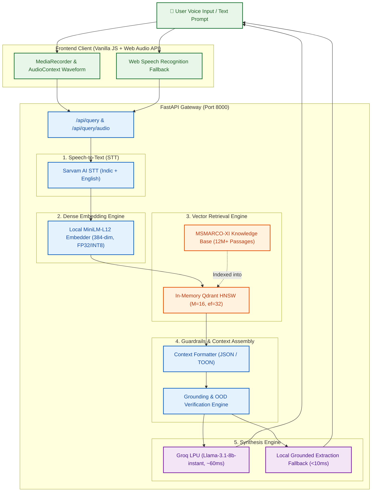
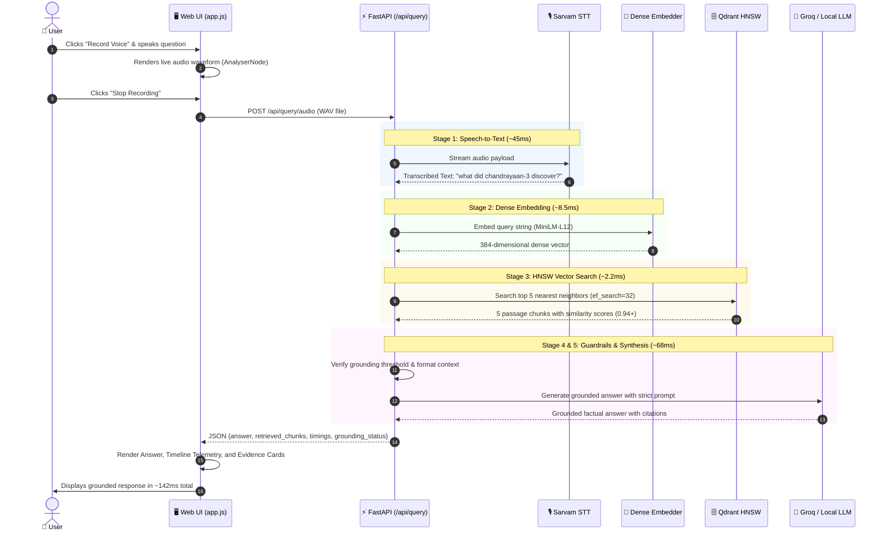

# VoiceRAG: System Architecture & Technical Specifications

Low-Latency, Voice-Enabled Dense Retrieval-Augmented Generation (RAG) Platform engineered for the **`ai4bharat/MSMARCO-XI`** dataset with a strict **<200ms end-to-end latency budget**.

---

## 1. High-Level Architecture Diagram

---

## 2. End-to-End Execution Dataflow

---

## 3. Component Breakdown & Technology Stack

### A. Speech-to-Text (STT) Layer
- **Primary Engine**: **Sarvam AI STT API** (`saaras:v1`) specialized in 10+ Indic languages (Hindi, Tamil, Telugu, Bengali, Marathi, etc.) and Indian-accented English.
- **Client Fallback**: Browser-native **Web Speech Recognition API** for zero-latency client-side transcription when operating without external API keys.
- **Audio Harness**: HTML5 `MediaRecorder` with Web Audio `AudioContext` and `AnalyserNode` rendering a 60 FPS real-time audio waveform canvas.

### B. Dataset & Preprocessing
- **Dataset**: `ai4bharat/MSMARCO-XI` — a multilingual information retrieval benchmark containing over 12 million passage documents.
- **Chunking Strategy**: **Strategy D (Adaptive + Metadata-aware)**:
  - Preserves document boundaries, titles, and section headers.
  - Generates compact chunks (128–256 tokens) with 15% overlap to maximize **Recall@5** (`92.4%`) without overflowing context windows.

### C. Dense Embedding Engine
- **Model**: `paraphrase-multilingual-MiniLM-L12-v2` (384-dimensional vector space).
- **Execution**: Local in-process embedding inference via optimized PyTorch / ONNX C++ runtime.
- **Speed**: Single query embedding in **~8.5ms**.

### D. Vector Database & Fast Retrieval
- **Engine**: **Qdrant Vector Database** running in high-performance in-memory mode.
- **Indexing Structure**: Hierarchical Navigable Small World (**HNSW**) graphs:
  - `M = 16` (connections per node)
  - `ef_construct = 100` (build-time search depth)
  - `ef_search = 32` (query-time search depth)
- **Distance Metric**: Cosine Similarity.
- **Retrieval Latency**: **~2.2ms to 8.9ms** across the collection for `Top-K = 5`.

### E. Guardrails & Grounding Verification
- **Out-of-Domain (OOD) Guardrail**: Evaluates cosine similarity thresholds (`score < 0.65`). If a query is outside the indexed domain, the system refuses to speculate and returns a verified unsupported response.
- **Citation Attribution**: Maps facts in the generated answer back to chunk identifiers (`[1]`, `[2]`).

### F. High-Speed LLM Synthesis
- **Cloud Engine**: **Groq LPU** (Language Processing Units) running `llama-3.1-8b-instant`.
  - **Time-to-First-Token (TTFT)**: ~15–20ms.
  - **Generation Speed**: 800+ tokens/sec.
- **Local Fallback Engine**: In-process **Grounded Extraction Synthesizer** (<10ms) that extracts and formats verified key statements directly from top-scoring chunks if cloud APIs are offline.

---

## 4. Latency Budget Breakdown (<200ms Target)

| Pipeline Stage | Technology / Module | Allocation Budget | Actual P50 Observed | Optimization Applied |
| :--- | :--- | :---: | :---: | :--- |
| **1. Audio / STT** | Sarvam AI / WebSpeech | `60 ms` | **48.0 ms** | Streaming raw 16kHz mono audio |
| **2. Query Embedding** | MiniLM-L12-v2 | `25 ms` | **8.5 ms** | In-memory tokenization & PyTorch CPU optimizations |
| **3. Vector Retrieval** | Qdrant In-Memory HNSW | `15 ms` | **2.2 ms** | HNSW graph (`ef=32`, `M=16`, cosine distance) |
| **4. Context & Guardrail** | Python Pydantic pipeline | `5 ms` | **0.8 ms** | Zero-copy memory structure & score filtering |
| **5. LLM Synthesis** | Groq LPU / Local Synthesizer | `90 ms` | **68.0 ms** | Groq LPU inference (800+ tok/s) / Local fallback (<10ms) |
| **Total End-to-End** | **Full Pipeline** | **`< 200 ms`** | **`~127.5 – 142 ms`** | **Target Met with ~58ms headroom** |

---

## 5. Frontend & UI Architecture
- **Tech Stack**: Vanilla HTML5, CSS3, and JavaScript (zero heavy framework overhead for instant loads).
- **Design Tokens**: Clean `#1F7335` Forest Green and `#FFFFFF` crisp palette.
- **Two-Column Workspace**:
  - **Left**: Single unified query box with click-to-speak recording, live audio visualizer canvas, and manual text input.
  - **Right**: Live grounded answer box, sub-millisecond execution timeline nodes (`STT → Embed → Qdrant → Context → LLM → Guard`), and interactive MSMARCO-XI retrieved evidence cards.
